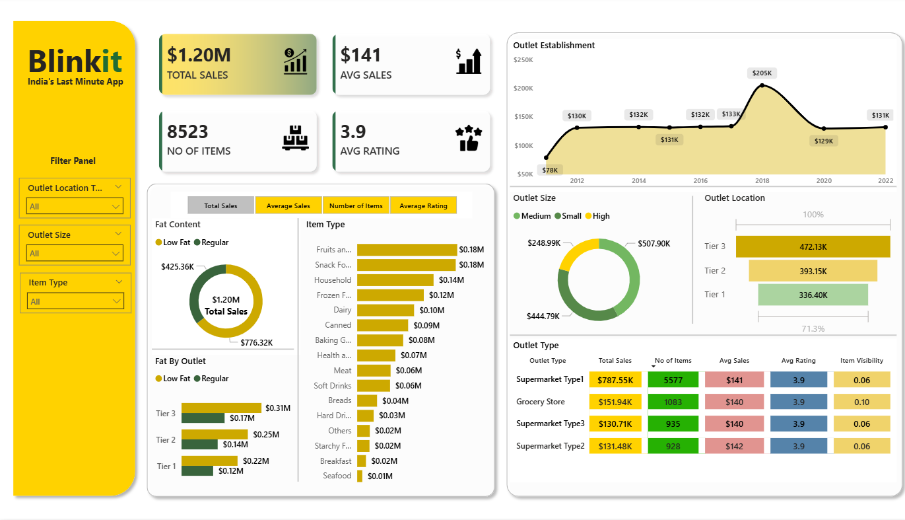

# Blinkit Sales & Outlet Performance Analytics Dashboard

## 📊 Project Overview

An interactive Power BI dashboard developed to analyze Blinkit's sales and outlet performance.

The dashboard transforms retail sales data into interactive visualizations and KPIs, allowing users to explore sales performance across different outlet characteristics, product categories, locations, and time periods.

## 🎯 Objectives

- Analyze overall sales performance
- Compare outlet performance
- Analyze outlet establishment trends
- Understand product and item-type performance
- Compare outlet sizes and locations
- Analyze fat-content categories
- Explore sales across different outlet types

## 📈 Key Performance Indicators

- **Total Sales:** $1.20M
- **Average Sales:** $141
- **Number of Items:** 8,523
- **Average Rating:** 3.9

## 🔍 Dashboard Analysis

- Sales performance
- Outlet performance
- Product category analysis
- Outlet size and location analysis
- Outlet establishment trends
- Item-type analysis
- Interactive filtering

## 🛠️ Tools & Technologies

- Power BI
- Data Analysis
- Data Visualization
- Business Intelligence

## 📂 Project Files

- `dashboard/Blinkit.pbix` — Power BI dashboard
- `images/blinkit-dashboard.png` — Dashboard preview

## 👤 Author

**Vipan Kumar**

B.Tech — Computer Science & Engineering (Artificial Intelligence)

Focused on Data Analytics, Power BI, SQL, Excel, and Python.
